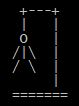

### PROGRAMA DESARROLLADO EN C

## Juego del ahorcado

El juego esta desarrallado en lenguaje C. El juego puede presentar errores 
debido a que es una version beta. Es decir, el juego esta a disposición de 
sugerencias. El juego contiene:

- Bucles
- Cadenas
- Metodos
- Condicionales

## ¿Cómo jugar?

1. Clone el repositorio de gitlab  `git clone 'link del repositorio'` 
2. Ejecute el archivo ahorcado_beta.exe
3. Ingrese en la opción 1 y digite la palabra a adivinar.
4. Ingrese en la opción 2 y a jugar!

## Modifcar el juego

Lo puede modificar a utilizando cuanquier compilador de C. Se recomienda el uso de *Dev-CPP*
